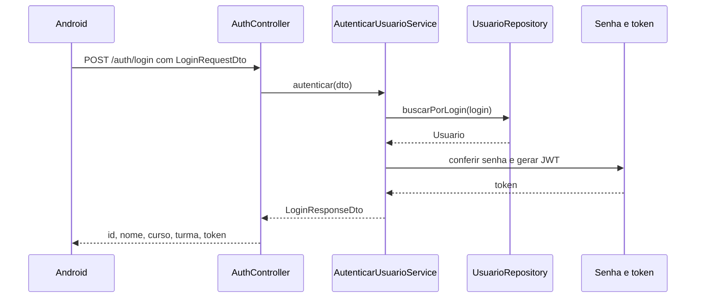

# Arquitetura do módulo de usuário

## 1. Decisão arquitetural

O projeto é um **monólito modular**: a API é compilada, iniciada e implantada como uma única aplicação, mas o código é dividido por capacidades de negócio.

O primeiro módulo se chama `usuario`, e não `autenticacao`. O motivo é que autenticar é uma ação; o usuário é o conceito de negócio que continuará existindo quando surgirem cadastro, consulta de perfil ou atualização de dados.

```text
modules/
├── usuario/
├── turma/                 # etapa futura
└── unidadecurricular/     # etapa futura
```

Não foram criados vários projetos Maven ou microsserviços, pois isso adicionaria complexidade sem ajudar o objetivo atual da aula.

## 2. DDD simplificado

Nesta etapa há somente uma entidade no domínio:

| Conceito | Representação | Responsabilidade |
|---|---|---|
| Usuário | `Usuario` | Entidade com identidade, dados acadêmicos e estado necessário para autenticar |
| Credenciais inválidas | `CredenciaisInvalidasException` | Falha com significado para o negócio |
| Autenticar usuário | `AutenticarUsuarioService` | Caso de uso que coordena a autenticação |

`Credenciais` e `UsuarioAutenticado` não aparecem como entidades. Eles representam dados que atravessam a fronteira do caso de uso e, por isso, foram modelados diretamente como DTOs:

| DTO | Direção | Campos |
|---|---|---|
| `LoginRequestDto` | entrada | `login`, `senha` |
| `LoginResponseDto` | saída | `id`, `nome`, `curso`, `turma`, `token` |

Essa escolha deixa explícita a diferença entre modelo de domínio e contrato de entrada/saída.

## 3. Camadas do módulo

```text
modules/usuario
├── domain
│   ├── Usuario.java
│   └── CredenciaisInvalidasException.java
├── application
│   ├── dto
│   ├── port/in
│   ├── port/out
│   └── service
├── infrastructure
│   ├── config
│   └── persistence
└── presentation
    └── AuthController.java
```

### `domain`

É o núcleo do negócio. Contém Java puro e não importa Spring, JPA, HTTP, JWT ou BCrypt.

### `application`

Contém o caso de uso, os DTOs e as portas. O serviço coordena as regras, mas conhece apenas interfaces para buscar o usuário, comparar a senha e gerar o token.

### `infrastructure`

Contém detalhes técnicos exclusivos do módulo, como entidade JPA, repositório Spring Data, adaptador de persistência e o ponto de composição do módulo.

### `presentation`

Recebe a requisição HTTP, valida o DTO e delega ao caso de uso. Não implementa a regra de autenticação.

## 4. Infraestrutura global

```text
infrastructure
├── config
│   └── OpenApiConfig.java
├── security
│   ├── SecurityConfig.java
│   ├── JwtConfig.java
│   ├── JwtTokenProvider.java
│   └── BCryptPasswordEncoderAdapter.java
└── web
    ├── ApiExceptionHandler.java
    └── ErrorResponseDto.java
```

Segurança, JWT, OpenAPI e tratamento global de erros não ficam dentro de `modules/usuario`, pois configuram a aplicação inteira e poderão atender outros módulos. A infraestrutura global depende das portas do módulo quando precisa implementá-las; o domínio não depende dela.

O repositório JPA continua dentro de `modules/usuario/infrastructure`, porque a forma de persistir e reconstruir um `Usuario` pertence ao módulo de usuário.

## 5. Portas e adaptadores

### Porta de entrada

```java
public interface AutenticarUsuarioUseCase {
    LoginResponseDto autenticar(LoginRequestDto credenciais);
}
```

O uso direto dos DTOs é uma simplificação consciente para o nível da turma. Evita criar `Command`, `Input`, `Output` ou outros objetos que repetiriam os mesmos campos sem acrescentar regra.

### Portas de saída

| Porta | Responsabilidade |
|---|---|
| `UsuarioRepository` | Buscar a entidade `Usuario` pelo login |
| `PasswordEncoderPort` | Comparar a senha recebida com o hash salvo |
| `TokenProviderPort` | Gerar um token para o usuário autenticado |

| Adaptador | Porta implementada | Tecnologia |
|---|---|---|
| `UsuarioPersistenceAdapter` | `UsuarioRepository` | Spring Data JPA |
| `BCryptPasswordEncoderAdapter` | `PasswordEncoderPort` | BCrypt |
| `JwtTokenProvider` | `TokenProviderPort` | JWT/Nimbus |

## 6. Fluxo do login



## 7. Ponto de composição

`UsuarioModuleConfig` conecta o caso de uso às implementações das portas:

```java
@Bean
AutenticarUsuarioUseCase autenticarUsuarioUseCase(
    UsuarioRepository usuarioRepository,
    PasswordEncoderPort passwordEncoder,
    TokenProviderPort tokenProvider
) {
    return new AutenticarUsuarioService(
        usuarioRepository,
        passwordEncoder,
        tokenProvider
    );
}
```

Com isso, `AutenticarUsuarioService` continua sendo Java puro e pode ser testado sem iniciar Spring, banco ou JWT real.

## 8. O que foi evitado nesta etapa

Para manter o projeto proporcional ao objetivo da aula, não foram adicionados:

- refresh token;
- múltiplos módulos Maven;
- event bus ou mensageria;
- domain events e specifications;
- factories para objetos simples;
- repositórios genéricos;
- microsserviços;
- tipos intermediários que apenas repetem os DTOs.

O isolamento do domínio foi preservado, sem transformar uma API pequena em uma demonstração excessivamente rígida de Clean Architecture.
